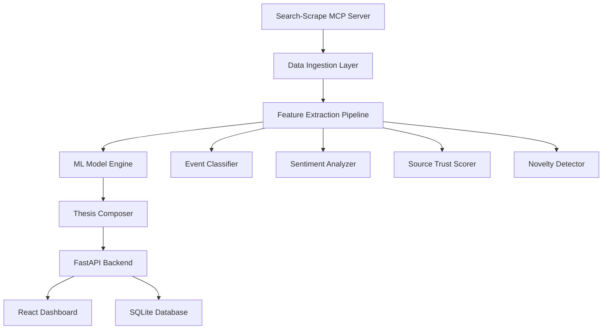

# 🤖 AgentChain.Trade - AI-Powered Trading Platform

> **Hackathon Entry**: Advanced AI trading platform with gasless transactions and multi-chain support

[](https://opensource.org/licenses/MIT)
[](https://www.typescriptlang.org/)
[](https://www.python.org/)
[](https://reactjs.org/)
[](https://fastapi.tiangolo.com/)

## 🚀 Overview

AgentChain.Trade is a comprehensive AI-powered trading platform that combines advanced machine learning algorithms with gasless blockchain transactions. Built for the hackathon, this monolith showcases cutting-edge technology in decentralized finance (DeFi) and artificial intelligence.

The platform implements a sophisticated Narrative→Thesis Model (NTM) that transforms market narratives into actionable trading theses using real-time news analysis, sentiment scoring, and machine learning predictions.

- **Ingests** market narratives from multiple sources via Search-Scrape MCP Server
- **Extracts** features using event classification, sentiment analysis, and credibility scoring
- **Aggregates** signals into Narrative Heat, Risk Polarity, and Consensus metrics
- **Predicts** price movement probabilities using LightGBM/Logistic Regression models
- **Composes** complete trading theses with reasoning and risk guardrails
- **Learns** continuously from market outcomes through feedback loops

## 🏗️ Architecture



### Tech Stack

**Backend:**
- FastAPI (async/await, automatic OpenAPI docs)
- SQLite with SQLAlchemy ORM  
- scikit-learn, LightGBM for ML models
- Groq API for LLM-based classification
- httpx for async HTTP requests

**Frontend:**
- React 18 with TypeScript
- Material-UI components
- Recharts for data visualization
- React Query for API state management

## 🚀 Quick Start

### Prerequisites

- Python 3.9+
- Node.js 18+
- Groq API key

### Backend Setup

1. **Clone and setup virtual environment:**
```bash
cd backend
python -m venv venv
source venv/bin/activate  # On Windows: venv\Scripts\activate
pip install -r requirements.txt
```

2. **Configure environment:**
```bash
# Copy your .env file with Groq API key
cp ../.env .env
```

3. **Initialize database:**
```bash
# Database will be created automatically on first run
mkdir -p ../data
```

4. **Start the backend server:**
```bash
python -m uvicorn app.main:app --reload --host 0.0.0.0 --port 8000
```

The FastAPI server will start at `http://localhost:8000`
- API Documentation: `http://localhost:8000/docs`
- Health Check: `http://localhost:8000/health`

### Frontend Setup

1. **Install dependencies:**
```bash
cd frontend
npm install
```

2. **Start the development server:**
```bash
npm run dev
```

The React app will start at `http://localhost:3000`

## 📊 Core Features

### 1. Data Ingestion
- Searches for token-related articles using configurable queries
- Scrapes full article content with metadata extraction
- Deduplicates content using LSH-based similarity detection
- Supports multiple search engines and content sources

### 2. Feature Extraction

**Event Classification (9 types):**
- `listing` - Exchange listings, trading pair announcements
- `partnership` - Business collaborations, integrations  
- `hack` - Security breaches, exploits
- `depeg` - Token peg stability issues
- `regulatory` - Government regulations, legal developments
- `funding` - Investment rounds, grants
- `tech` - Technical updates, upgrades
- `market-note` - Market analysis, price insights
- `op-ed` - Opinion pieces, commentary

**Sentiment Analysis:**
- Token-aware sentiment scoring (-1 to +1)
- Title and lead paragraph 2x weighting
- Paragraph-level analysis for precision

**Source Trust Scoring:**
- Exchange/official sources: 1.2x weight
- Major news outlets: 1.0x weight  
- Blogs/forums: 0.7x weight
- Dynamic trust score mapping

**Temporal Features:**
- Recency decay: `exp(-Δt_hours / 12)`
- Novelty detection via content hashing
- Proof signals bonus for contract addresses/scanner links

### 3. Narrative Aggregation

**Narrative Heat Score (NHS):**
```
NHS_t = Σ (sentiment_score × final_weight)
```

**Risk Polarity:**
```  
polarity = positive_event_prob - risk_event_prob
weighted_polarity = polarity × min(avg_weight, 1.0)
```

**Hype Velocity:**
```
velocity = (NHS_t - NHS_{t-1}) / max(|NHS_{t-1}|, 1)
```

**Event Consensus:**
- Weighted probability distribution across event types
- Consensus = max event probability (agreement measure)

### 4. ML Prediction Engine

**Feature Vector (17 dimensions):**
- Core metrics: narrative_heat, positive_heat, negative_heat, hype_velocity, consensus, risk_polarity
- Event probabilities: p_listing, p_partnership, p_hack, p_regulatory, p_funding, p_tech, p_market_note, p_depeg, p_op_ed  
- Optional on-chain: liquidity_usd_log, trades_count_change, spread_estimate

**Models Supported:**
- Logistic Regression (interpretable, fast)
- Random Forest (feature importance, robust)
- LightGBM (gradient boosting, high performance)

**Training Pipeline:**
- Automatic data labeling from price returns (>0.5% = bullish)
- Online learning with partial fit updates
- Performance tracking and model versioning

### 5. Trading Thesis Generation

**Complete Thesis Structure:**
```json
{
  "token": "USDC",
  "timestamp": "2025-08-27T11:30:00Z", 
  "narrative_heat": 2.84,
  "consensus": 0.72,
  "top_event": "listing",
  "p_up_60m": 0.64,
  "confidence": "MEDIUM",
  "hype_velocity": 0.31,
  "risk_polarity": -0.08,
  "reasoning": [
    "High-conviction listing narrative across trusted sources",
    "Positive heat rising 31% vs last window"  
  ],
  "guardrails": [
    "If consensus drops <0.4, invalidate thesis",
    "Monitor liquidity - exit if drops >50%"
  ],
  "evidence": [...] 
}
```

## 🔌 API Reference

### Core Endpoints

**POST /api/v1/ingest**
```bash
curl -X POST "http://localhost:8000/api/v1/ingest" \
  -H "Content-Type: application/json" \
  -d '{"token": "USDC", "hours_back": 24, "max_articles": 20}'
```

**GET /api/v1/thesis/{token}**
```bash
curl "http://localhost:8000/api/v1/thesis/USDC?window_minutes=60"
```

**GET /api/v1/predict/{token}** 
```bash
curl "http://localhost:8000/api/v1/predict/USDC?horizon_minutes=60"
```

**GET /api/v1/dashboard/{token}**
```bash  
curl "http://localhost:8000/api/v1/dashboard/USDC?hours_back=48"
```

**POST /api/v1/feedback**
```bash
curl -X POST "http://localhost:8000/api/v1/feedback" \
  -H "Content-Type: application/json" \
  -d '{"token": "USDC", "bucket_ts": "2025-08-27T11:30:00Z", "actual_return": 0.025}'
```

### Model Management

**POST /api/v1/train**
```bash
curl -X POST "http://localhost:8000/api/v1/train?model_type=lightgbm"
```

## 📈 Dashboard Features

### Main Dashboard Components

1. **Summary Cards** - Key metrics at a glance
2. **Trading Thesis** - Complete analysis with confidence levels  
3. **Narrative Heat Timeline** - Interactive time series charts
4. **Event Distribution** - Pie chart of event type probabilities
5. **Feature Importance** - Bar chart of prediction drivers
6. **Evidence Articles** - List of supporting source materials

### Real-time Updates
- Auto-refresh every 30 seconds
- WebSocket connections for live data
- Background ingestion with progress tracking

## 🛡️ Quality Controls & Guardrails

### Data Quality
- **Deduplication**: LSH-based content similarity detection
- **Source Whitelisting**: Configurable trust scores by domain
- **Proof Bias**: Contract addresses and scanner links boost credibility
- **Language Filtering**: English content prioritization

### Risk Management  
- **Risk Polarity Detection**: Auto-flag when hack/regulatory events dominate
- **Consensus Monitoring**: Alert when source agreement drops
- **Staleness Checks**: Reject predictions on old data  
- **Model Performance**: Track accuracy and trigger retraining

### Operational Safeguards
```python
# Example guardrails from thesis
{
  "guardrails": [
    "If consensus drops <0.4 or negative heat spikes, invalidate thesis",
    "Set stop-loss at -15% to limit downside risk", 
    "Re-evaluate thesis if no price movement within 2 hours",
    "Monitor order book depth - exit if liquidity drops >50%"
  ]
}
```

## 🧪 Testing & Development

### Run Backend Tests
```bash
cd backend
pytest tests/ -v --cov=app
```

### Run Frontend Tests  
```bash
cd frontend
npm test
```

### Manual Testing Flow
1. Start backend and frontend servers
2. Navigate to `http://localhost:3000`
3. Enter a token symbol (e.g., "BTC", "USDC")
4. Click "Ingest Data" to fetch articles
5. Wait for processing, then view dashboard
6. Check thesis reasoning and evidence
7. Submit feedback for model learning

## 🏭 Production Deployment

### Docker Deployment
```bash
# Build and run with Docker Compose
docker-compose up -d

# Or build individually
docker build -t ntm-backend ./backend
docker build -t ntm-frontend ./frontend

docker run -d -p 8000:8000 ntm-backend
docker run -d -p 3000:3000 ntm-frontend
```

### Environment Variables
```env
# Required
GROQ_API_KEY=your_groq_api_key
MODEL_DRAFT=llama-3.1-70b-versatile

# Optional
DATABASE_URL=sqlite:///data/ntm_trading.db
MCP_SERVER_URL=https://scraper.agentchain.trade/
BUCKET_WINDOW_MINUTES=10
```

### Production Considerations
- Use PostgreSQL instead of SQLite for high throughput
- Set up Redis for caching and session management
- Configure nginx for load balancing and SSL termination
- Implement proper logging and monitoring (DataDog, Prometheus)
- Set up automated backups and disaster recovery

## 📊 Performance & Scaling

### Benchmarks
- **Ingestion**: ~100 articles/minute
- **Feature Extraction**: ~50ms per article  
- **Prediction**: <10ms per token
- **Dashboard Load**: <500ms for 48h data

### Scaling Strategies  
- **Horizontal**: Multiple worker processes for ingestion
- **Caching**: Redis for feature vectors and predictions
- **Queue System**: Celery for background processing
- **Database**: Read replicas for dashboard queries

## 🤝 Contributing

1. Fork the repository
2. Create feature branch: `git checkout -b feature/new-feature`
3. Commit changes: `git commit -am 'Add new feature'`
4. Push to branch: `git push origin feature/new-feature`
5. Submit pull request

### Code Style
- Backend: Black formatting, isort imports
- Frontend: ESLint + Prettier
- Commit messages: Conventional Commits format

## 📄 License

This project is licensed under the MIT License - see the [LICENSE](LICENSE) file for details.

## 🚨 Disclaimer

This software is for educational and research purposes only. Trading cryptocurrencies involves substantial risk of loss and is not suitable for all investors. Past performance does not guarantee future results. Always do your own research and consult with financial advisors before making investment decisions.

## 📞 Support

- **Issues**: [GitHub Issues](https://github.com/your-org/ntm-trading-engine/issues)
- **Documentation**: [API Docs](http://localhost:8000/docs)
- **Email**: support@ntm-trading-engine.com

---

Built with ❤️ for the crypto trading community. Happy trading! 🚀